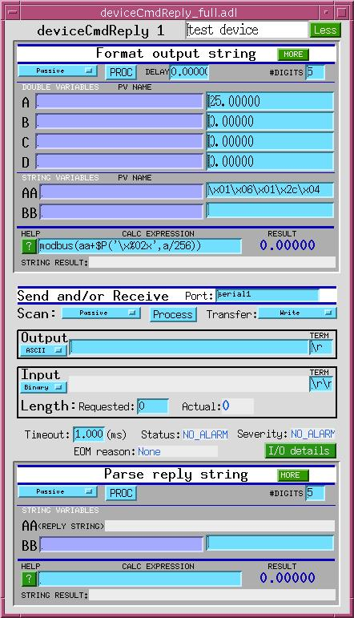

deviceCmdReply
==============

Introduction
------------

deviceCmdReply is an EPICS database that can be programmed at run time to *integrate into EPICS* a *message based* device for which no EPICS support has been written. A single deviceCmdReply database can format and send one command string to a device and then read and parse one reply string. Strings are limited to 39 bytes, and may contain any ASCII characters, including the null character, They also may contain any checksum or CRC supported by the sCalcout record. > *Integrate into EPICS* means "provide an EPICS PV that represents a value in the device", so that if one writes to the EPICS PV, the value gets written to the device; or if one reads from the EPICS PV, one gets a value from the device. (Note that writing to an EPICS PV via channel access can cause the processing that gets the value out to the device, but reading from a PV via channel access will not cause processing to occur. If you want a PV to track some value in the device, you must arrange for that value to be read. For example, you might configure the deviceCmdReply database to process periodically.)

> A *message based* device is one that communicates with its user via sequences of bytes -- typically, ASCII character strings. Message based devices typically communicate via serial, GPIB, or socket (TCP/IP or UDP/IP) interfaces.

deviceCmdReply is essentially a wrapper around the EPICS [asyn record](http://www.aps.anl.gov/epics/modules/soft/asyn/R4-6/asynRecord.pdf)<a>. The deviceCmdReply database consists essentially of two sCalcout (string-calc-and-output) records -- one to format the command, one to parse the reply -- and an asyn record, which performs the actual writing and reading. The asyn record provides most of the raw capabilities of deviceCmdReply. Among them are the following: </a>

| write to and read from serial, GPIB, or socket interface | This allows deviceCmdReply to control a wide range of devices. |
|---|---|
| connect several asyn records to a single port | This allows multiple instances of deviceCmdReply to work together to control different aspects of a single device. Infrastructure supporting the asyn record keeps multiple intances of deviceCmdReply from interfering with each other, and with other asyn-based support talking to the same device. This capability also permits deviceCmdReply to *supplement* existing support for a message based device. |
| disconnect from one port and connect to another port without interfering with ongoing port traffic | This permits one to load a small number of deviceCmdReply databases, whose eventual use may not even be known at load time, and to target as many of those databases as are needed at a particular device, to support the required set of commands. |
| modify port configuration at run time | This allows the user to try, for example, different baud rates and handshaking arrangements, to find one that works. |
| show commands and replies as they actually are sent and received | This allows the user quickly and efficiently to debug command formatting, reply parsing, and interface configuration. |
|  |  |
|  |  |

Thus, several instances of deviceCmdReply can be targeted at a single device, to implement different commands, or read different values. For example, a single deviceCmdReply might periodically read the readback temperature from a controller, while another deviceCmdReply is used to write the temperature set point.

### Other ways to write device support

deviceCmdReply is a quick way to get something running in a pinch, and it's a nice tool for prototyping -- for trying out commands and port configurations, to see how a device behaves. But it's not the best way to write real device support. Better strategies for writing message based device support include the following: | streamDevice | Connects standard EPICS record types directly to hardware, using a protocol file to specify the command formatting, reply parsing, etc. See [streamDevice 2](http://epics.web.psi.ch/software/streamdevice/) |
|---|---|
| devXxStrParm | Connects selected record types directly to hardware. Command formatting and reply parsing are specified with in the user-parameter section of output or input links. See devXxStrParm.README in the documentation directory of the synApps __ip__ module. |
| SNL | Typically, SNL code monitors PV's and writes to/reads from hardware using an asyn record. |
| Other | There are other approaches in use, but I don't know enough about them to describe how they work. |

How to deploy deviceCmdReply
----------------------------

deviceCmdReply is part of the synApps __[ip](https://github.com/epics-modules/ip)__ module, and it requires the EPICS __[asyn](https://github.com/epics-modules/asyn)<a></a>__ module and the synApps __[calc](https://github.com/epics-modules/calc)__module to operate. This documentation assumes version 2.7 of the __ip__module, version 4.6 or higher of __asyn__, and version 2.6.3 or higher of __calc__.

### Building and installation

The recommended way to build this software is to build synApps, which includes it, supports it, and provides an example ioc directory that deploys and uses it. It certainly is both possible and practical to build and install only the modules required for this particular piece of software, but we don't have the staff to write documentation that describes the building and installation of individual pieces of synApps. (The number of possible combinations of required modules is huge -- undoubtedly far larger than the number of custom installations that might actually occur -- and it changes as synApps develops. So if we did write such arrangement-specific documentation, *most* of it would never even be read.) ### Loading into an ioc

The database is loaded into an ioc with the following example command:

```
dbLoadRecords("$(IP)/ipApp/Db/deviceCmdReply.db",
    "P=xxx:,N=1,PORT=serial1,ADDR=0,OMAX=40,IMAX=40")
```

where `$(IP)` will be expanded to the value of the environment variable `IP` -- the full path to the __ip__ module. (The EPICS build will put this in the `cdCommands` file if `IP` is defined in the file `configure/RELEASE`.)

The following macro arguments target or configure the database to a specific application:

`P=xxx:` defines a short sequence of characters intended to distinguish record names in this ioc from the names of similar records loaded into some other ioc `N=1`defines another short sequence of characters intended to distinguish the different deviceCmdReply databases loaded into the same ioc from each other `PORT=serial1` defines the *port* to which the asyn record will connect initially. (The port can be changed at run time.) `ADDR=0`ignored unless the port to which the asyn record connects can communicate with more than one device. For example, if the port is a GPIB interface, or an RS485 serial interface, `ADDR` specifies which of several devices is to be written to or read from. (The address can be changed at run time.) `OMAX=40`tells the asyn record how much space to allocate for its binary output array `BOUT`. This matters only if `BOUT` is used, which happens only if the asyn record's `OFMT` field is set to "Binary" or "Hybrid". If `OFMT` is set to "ASCII" (the default), then the `AOUT` field is used instead of `BOUT`. `AOUT` is an EPICS string, with a fixed size of 40 bytes. `IMAX=40`tells the asyn record how much space to allocate for its binary input array `BINP`. This matters only if `BINP` is used, which happens only if the asyn record's `IFMT` field is set to "Binary" or "Hybrid". If `IFMT` is set to "ASCII" (the default), then the `AINP` field is used instead of `BINP`. `AINP` is an EPICS string, with a fixed size of 40 bytes. This database will contain the following records by which the user programs the device:

| record name | record type | function |
|---|---|---|
| *xxx:*deviceCmdReply*n*\_formatCmd | sCalcout | build the string to be written to the device |
| *xxx:*deviceCmdReply*n*\_do\_IO | asyn | send to/receive from hardware |
| *xxx:*deviceCmdReply*n*\_parseReply | sCalcout | parse reply string |

where *xxx:* was specified by the *P* macro, and *n* was specified by the *N* macro.

From now on, I'll call these records "..formatCmd", "the asyn record", and "...parseReply", respectively.

### Arranging for save/restore 

It would be very inconvenient to have to reprogram a set of deviceCmdReply databases after every ioc reboot, and because they are designed to be programmed by users on a running ioc, one would like to have the databases autosaved. You can do this by adding the following line to an autosave request file: 
```
file deviceCmdReply.req P=$(P),N=1
```

where `P` and `N` are the same as in the above `dbLoadRecords` command, for each database loaded.

### Loading the user interface

Several MEDM display files are provided in the modules that together support deviceCmdReply. The __ip__ module contains the display pictured below, and abbreviated versions of it, which are the main user interface for a single instance of deviceCmdReply. These displays contain buttons that call up related displays maintained by the __calc__ and __asyn__ modules, which provide detailed control and some user documentation for the sCalcout and asyn records used in deviceCmdReply. This display can be called up from another MEDM display with a "Related Display" button defined with the same macro arguments as in the dbLoadRecords() command above:

| Display Label | Display File | Arguments |
|---|---|---|
| whatever | deviceCmdReply\_full.adl | P=xxx:,N=1 |

Programming
-----------

1. The first choice to make in the programming of a deviceCmdReply instance is the port name that will get us connected to the device we want to control. Near the center of the display, next to the words "Send/Receive", is a text-entry field containing the name of the port to which the asyn record is connected. This field belongs to the asyn record; its full name is "*xxx:*deviceCmdReply*n*\_do\_IO.PORT". You can change this to any port that supplies an asynOctet interface.
2. The next choice is what input/output operations are to be performed. The asyn record's `TMOD` field (labelled "Transfer:" in this display, and in the asyn record's "asynOctet.adl" display) controls this, and provides the following options: | Write/Read | Send a command and wait for a reply |
    |---|---|
    | Write | Send a command |
    | Read | Wait for a reply |
    | Flush | Not used in deviceCmdReply |
    | NoI/O | Useful for testing, and for disabling output while the "..formatCmd" record is being configured. |
    
    When `TMOD` includes "Write", the first sCalcout record ("...formatCmd") is used to format the string to be sent to the device. It places the formatted string into the asyn record's `AOUT` field, and causes the asyn record to process.
    
    When `TMOD` includes "Read", the second sCalcout record ("...parseReply") is processed by the asyn record after the device read has completed. It retrieves the string read by the asyn record from the asyn record's `AINP` or `BINP` field, depending on the asyn record's `IFMT` field. If `IFMT` = ASCII, then `AINP` is used, otherwise `BINP` is used.
3. If `TMOD` includes "Write", the next job is to program the "...formatCmd" sCalcout record to craft an output command string from the information available to it. The information available to an sCalcout record includes any numeric or string value that has been written to one of its fields, and the values of any other EPICS PVs to which the sCalcout record can connect an input link. Note that the asyn record will append a terminator to the command if the asyn record's `OEOS` field (the text field labelled "TERM" in the "Output" section of the display above) is not empty. The terminator can be any one or two character string. Common terminators include "\\r" (carriage return) and "\\r\\n" (carriage return, line feed).
4. If `TMOD` includes "Write", the next job is to configure the asyn record to talk to the port that connects with the device. Click on the "I/O details" related display button to see a menu of the asyn-record displays with which this can be done. For example, you might select "Serial port parameters" to specify the baud rate, etc.
5. If `TMOD` includes "Read", the next job is to configure the asyn record so that it can recognize when the device has finished sending a reply. Three strategies for recognizing the end of a transmission are supported by the asyn record: 
    1. Some devices append a terminator by which the end of string can be recognized. In this case, set the asyn record's `IEOS` field (the text field labelled "TERM" in the "Input" section of the display above) to the terminator the device will use. (This terminator will be stripped from the string before it is displayed and passed to the "...parseReply" sCalcout record.)
    2. Other devices will send a predictable number of characters. In this case, set the asyn record's `NRRD` field (the text field labelled "Length Requested", in the "Input" section of the above display) to the expected number of characters
    3. If the device will do neither of the above, set the asyn record's `TMOT`field (the text field labelled "Timeout:") to the number of seconds after which the reply is certain to have arrived.
6. If `TMOD` includes "Read", the next job is to program the "...parseCmd" sCalcout record to parse the string returned by the device, and extract from it the number or string in which you're interested.

Examples
--------

### Formatting printable output strings

For most devices, command strings are pretty simple: some fixed text, followed by a number encoded in some way, maybe followed by some more fixed text. Simple strings with embedded numbers are easily formatted using the sCalcout record's `PRINTF(format,variable)` function, which may be abbreviated as `$P(format,variable)`. - In the following examples, the number to be sent to the device is written to the sCalcout record's `A` field.
    
    | desired output | CALC expression | comment |
    |---|---|---|
    | M*03*; | $P("M%02d;",A) | doesn't guarantee 2 digits if `A` &gt; 99 |
    | M*03*; | $P("M%02d;",max(0,min(99,A))) | enforces limit on `A` |
    | S*1.234000* | $P("S%f",A) | default precision and field width |
    | S*1.234* | $P("S%.3f",A) | controlled precision |
    | S *1.234* | $P("S%6.3f",A) | controlled precision and field width |
    | S*01.234* | $P("S%06.3f",A) | leading zero pad, if needed |
- Sometimes there are two numbers that have to be sent (e.g., an address which we'll assume is in the "..formatCmd" record's `A` field, and a value to be sent to that address, which we'll assume is in the `B` field). Note that the command will be sent when *either* `A` or `B` is written to (via channel access). You can work around this by setting the asyn record's `TMOD` field to "NoI/O" when you don't want the command sent. | desired output | CALC expression | comment |
    |---|---|---|
    | M*03*=*4.235* | $P("M%02d=",A)+$P("%.3f",B) | Note $P() takes only two arguments. |
- Sometimes a device's command syntax will require that an integer be split into separate bytes: | desired output | CALC expression | comment |
    |---|---|---|
    | M3=*01*;M3=*74* | $P("M3=%02d",A&gt;&gt;8)+$P("M4=%02d",A&amp;255) | A=330, sent as base 10 numbers |
    | M3=*01*;M3=*4A* | $P("M3=%02X",A&gt;&gt;8)+$P("M4=%02X",A&amp;255) | A=330, sent as hex numbers |
- Sometimes the device wants to see text strings, but the software that will use the device wants to send numbers instead. For example, you might want to send the number "1" to open a shutter, and the number "0" to close it, but the device wants to see strings like "S0 OPEN" and "S0 CLOSE". In this case, you can make an array of strings that correspond with numbers by putting the "0" string in the sCalcout record's `AA` field, the "1" string in the `BB`, etc., and treating the string fields as an array, using the stringCalc operator "@@" to index the array: | desired output | CALC expression | comment |
    |---|---|---|
    | S0 OPEN | $P("S0 %s",@@A) | A addresses the string array: AA="CLOSE";BB="OPEN" |
- There is one special character you'll have to watch out for. The backslash character "\\" will be treated by the asyn record as the beginning of an escape sequence. To send a single backslash to the device, you must escape it with another backslash: | desired output | CALC expression | comment |
    |---|---|---|
    | \\ | "\\\\" | small price to pay for the ability to send unprintable characters |

### Formatting unprintable output

Some devices want to see numbers in their raw, binary form. Prior to EPICS version 3.14, there was no widely supported way to pass strings that might contain embedded ASCII NULL characters from one record to another, so deviceCmdReply would not have been useable for this class of devices.

But EPICS 3.14 provides an escape-translation service for strings containing unprintable characters, to put their content into a form that can be transported in a normal EPICS string. This allows us to load such strings into a database, send them via channel access, autosave them, etc. For purposes here, the service is implemented by the pair of functions `dbTranslateEscape()`, which produces raw binary from a string containing escape sequences, and `epicsStrSnPrintEscaped()`, which does the opposite. (See the *EPICS Application Developer's Guide* for more information.)

In the following tables, a one-byte binary value will be represented by *&lt;n&gt;*

- In the simplest case of sending fixed binary numbers, you can encode them as escape sequences. | desired output | CALC expression | comment |
    |---|---|---|
    | *&lt;2&gt;*\#*&lt;254&gt;* | "\\x02#\\xfe" | using hex escape sequences |
    | *&lt;2&gt;*\#*&lt;254&gt;* | "\\002#\\376" | using octal escape sequences |
- To embed variable binary numbers into an output string, you can use the sCalcout record's `WRITE(format,variable)` command, which may be abbreviated as `$W(format,variable)`. This function will encode its result as an escaped string, for transmission to the asyn record. The asyn record will translate the string into its raw, binary form before sending it to the device.
    
    > The format-indicator characters used with `WRITE()` are intended to be familiar from experience you may have had with the standard C library's `printf()` function, but they're used here to specify how *binary* numbers will be encoded, so any field-width or precision specifications will be ignored.
    
    | desired output | CALC expression | comment |
    |---|---|---|
    | *&lt;2&gt;* | $W("%c",A) | encode the value of the sCalcout record's A field as a one-byte integer |
    | *&lt;2&gt;*\#*&lt;254&gt;* | $W("%hd",A)+"#"+$W("%hd",B) | encode A and B as two-byte integers |
    | *&lt;2&gt;* | $W("%d",A) | encode A as a four-byte integer |
    | *&lt;2.1&gt;* | $W("%f",A) | encode A as a four-byte float |
    | *&lt;2.1&gt;* | $W("%lf",A) | encode A as an eight-byte float |
- Some devices require a checksum (or CRC) appended to the command string, and will ignore the command if the checksum doesn't have the correct value. The checksum is calculated from (part of) the command string, and typically must be appended to it. The sCalcout record supports a small number of checksums, and each type comes in two flavors: a function that calculates the checksum, from a supplied string, and returns it; and a function that appends the checksum to the supplied string, and returns the string. | desired output | CALC expression | comment |
    |---|---|---|
    | *&lt;2&gt;&lt;10&gt;&lt;3&gt;&lt;XOR checksum&gt;* | ADD\_XOR8("\\002"+$W("%c",A)+"\\003") | append XOR8 checksum to string |
    | *&lt;2&gt;&lt;10&gt;&lt;3&gt;&lt;modbus checksum&gt;* | MODBUS("\\002"+$W("%c",A)+"\\003") | append modbus/RTU CRC to string |

### Parsing printable input strings

When the asyn record has received a reply from the device, it will cause the "...parseReply" sCalcout record to process. The first thing the sCalcout record will do is retrieve the reply string from the asyn record's `AINP`field, and put it in the sCalcout record's `AA` field. Our job here, then, is simply to parse the content of the `AA` field. Parsing the reply from a device generally requires two operations: we have to specify the part of the reply that contains the information of interest; and we have to convert that information to the desired form. - In the simplest possible case, the sCalcout record will both find and convert for us. The function `INT(string)` searches `string` for the first thing that looks like an integer number, and returns the value of that number. Similarly, the function `DBL(string)` searches `string` for the first thing that looks like a floating point number, and returns its value. | reply string | CALC expression | comment |
    |---|---|---|
    | VALUE=12 | INT(AA) | convert to integer |
    | VALUE=1.23 | DBL(AA) | convert to double-precision number |
- But that only works if the number we want really is the first thing that looks like a number. In a more complicated case, we'll have to wade through some uninteresting stuff to get to the number. If the uninteresting stuff is of fixed length, we can just move a specified number of characters into the string before converting: | reply string | CALC expression | comment |
    |---|---|---|
    | VALUE1=1.23 | INT(AA\[7,-1\]) | move past "VALUE1=" and convert to float |
    | VALUE1=1.23 | $S(AA,"%\*7c%f") | skip 7 characters and convert to float |
    
    > See the sCalcout record documentation for more information on the substring operator "`[]`". For purposes here, the syntax is `[<start>,<end>]`. If `<start>` is a number, it indicates the number of bytes to skip. `<end>` will always be -1 in this documentation.
- If the uninteresting stuff is not of fixed length, but the variable-length part of it ends with some fixed string (or even the nth instance of some fixed string), we can skip to the *interesting stuff* as follows: | reply string | CALC expression | comment |
    |---|---|---|
    | REG237=*1.23* | DBL(AA\["=",-1\]) | move past "=" and convert to double |
    | reg:2 *1.23* | $S(AA,"%\*s %f) | move past " " and convert to float |
    | R1=1.23 R32=R*7* | INT(AA\["=",-1\]\["=",-1\]) | move past two "=" characters, find an integer |
    
    > In examples above, we've used the substring operator "`[<start>,<end>]`" with a string-valued first argument -- a pattern string -- and the usual second argument of -1. If the pattern is found, the result of the operation is the substring beginning just after the pattern, and continuing to the end of string. (If the pattern occurs more than once, only the first instance counts.)

### Parsing unprintable input

Parsing unprintable input poses a different sort of problem than parsing printable input. The strategy is still pretty simple: move to the interesting stuff and convert it. But moving to the interesting stuff might be complicated by escape sequences in the preceding bytes. I'll first discuss moving as a separate problem, and then worry about converting it.

- In the simplest case, the bytes we have to move through are fixed, and we can use the `[]` operator, as in the previous section. If the fixed bytes include escape sequences, we just treat them as plain text for the purpose of counting characters, or of recognizing patterns. In the following examples, &lt;2&gt; represents an unprintable byte whose binary value is 2: | actual reply string | reply string as we see it | expression | comment |
    |---|---|---|---|
    | &lt;2&gt;&lt;target&gt; | \\002&lt;target&gt; | AA\[4,-1\] | skip one actual byte, encoded as a four-byte escape sequence |
    | &lt;2&gt;abc&lt;3&gt;&lt;target&gt; | \\002abc\\003&lt;target&gt; | AA\[11,-1\] | skip five actual bytes, encoded as an 11-byte escape sequence...OR... |
    | &lt;2&gt;abc&lt;3&gt;&lt;target&gt; | \\002abc\\003&lt;target&gt; | AA\["\\003",-1\] | just find the "\\003" escape sequence |
    |
- If the bytes we have to move through to get to the interesting stuff include escape sequences that are *not* fixed, we can't just skip over a specific number of bytes, because different byte values generally will be encoded as escape sequences of different lengths. For example, the byte value 10 will be encoded as "\\n"; 14 will be encoded as "\\016"; and 71 will be encoded as "G". Thus, in this case we can't count bytes in the escaped string to find the interesting stuff, and an expression like "`AA[<number>,-1]`" will not work. We may still be able to use an expression like `AA[<string>,-1]` to pattern match the bytes immediately preceding the interesting stuff, but only if the pattern is fixed and cannot also occur earlier in the reply string.
    
    | actual reply string | reply string as we see it | expression | comment |
    |---|---|---|---|
    | &lt;?&gt;abc&lt;3&gt;&lt;target&gt; | &lt;? bytes&gt;abc\\003&lt;target&gt; | AA\["abc\\003",-1\] | find the "abc\\003" escape sequence |
    |
- In the worst case (that this software can handle), the bytes we have to move through to get to the interesting stuff are not fixed, and don't end with a sequence we can pattern match, but the number of bytes is known. In this case, we must count bytes in the raw, binary string. Fortunately, the `READ(string,format)` function can do this, because it converts the string from which it reads into binary form before parsing it, and because it permits a conversion indicator whose assignment is suppressed. | actual reply string | reply string as we see it | expression | comment |
    |---|---|---|---|
    | &lt;n&gt;&lt;target&gt; | &lt;N bytes&gt;&lt;target&gt; | READ(AA,"%\*Nc...") | skip N bytes in raw string |
    |

So now we have the tools to do some actual conversions. We'll use the `READ(string, format)` function (which may be abbreviated as `$R(...)`) to convert. As before, the *interesting stuff* is marked with color.:

- The simplest case: | actual reply string | reply string as we see it | expression | comment |
    |---|---|---|---|
    | &lt;2&gt;*&lt;6&gt;* | \\002*\\006* | READ(AA\[4,-1\],"%c") | skip four-byte escape sequence, read 8-bit integer |
    | &lt;2&gt;*&lt;7&gt;&lt;2&gt;* | \\002*\\a\\002* | READ(AA\[4,-1\],"%hd") | skip four-byte escape sequence, read 16-bit integer |
    | &lt;2&gt;*&lt;5&gt;&lt;1&gt;&lt;3&gt;&lt;4&gt;* | \\002\\005\\001\\003\\004 | READ(AA\[4,-1\],"%d") | skip four-byte escape sequence, read 32-bit integer |
    | &lt;2&gt;abc&lt;3&gt;*&lt;10&gt;* | \\002abc\\003\\n | AA\[11,-1\] | skip 11-byte escape sequence, read 8-bit integer |
    | &lt;2&gt;abc&lt;3&gt;*&lt;101&gt;&lt;5&gt;* | \\002abc\\003A\\005 | READ(AA\["\\003",-1\],"%hd") | find "\\003", read 16-bit integer |
    | &lt;?&gt;abc&lt;3&gt;*&lt;5&gt;* | &lt;? bytes&gt;abc\\003*\\005* | READ(AA\["abc\\003",-1\],"%c") | find "abc\\003", read 8-bit integer |
    | &lt;3 bytes&gt;*&lt;4&gt;* | &lt;? bytes&gt;*\\004* | READ(AA,"%\*3c%c") | skip 3 bytes in raw string, read 8-bit integer |
